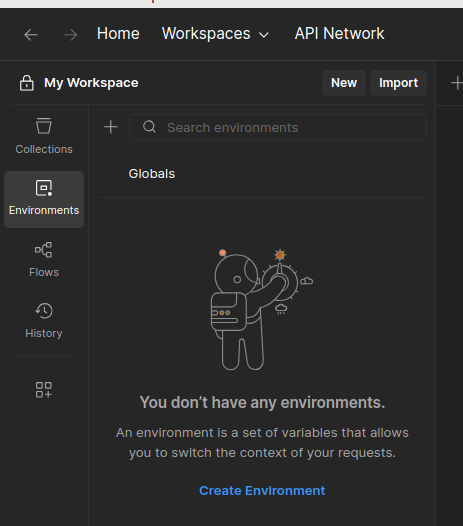
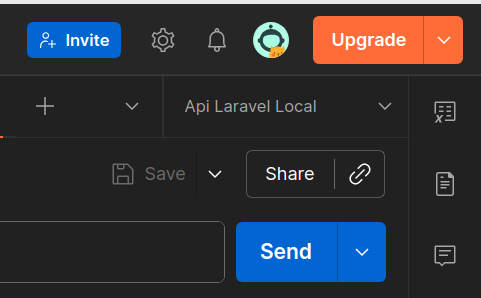
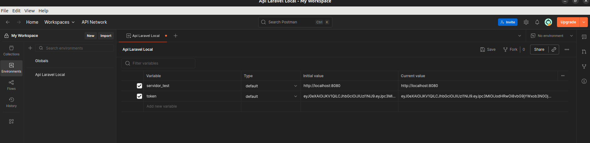
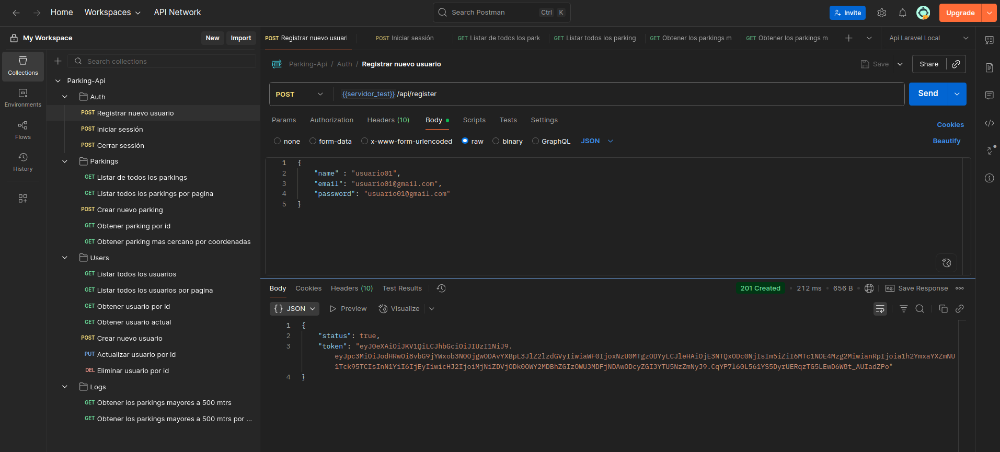
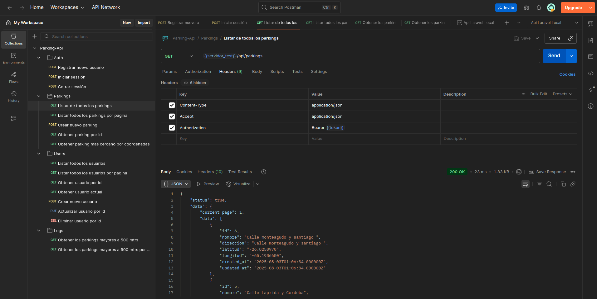

# Probar la API con Postman

Este proyecto incluye una colección de Postman con todos los endpoints listos para usar. Esto permite probar la API de forma visual e interactiva, sin necesidad de escribir comandos manualmente.

--- 

## 📦 Importar la colección

1. Abrí Postman.
2. Hacé clic en **Importar** (botón en la parte superior izquierda).
3. Seleccioná el archivo [postman/postman_collection.json](./postman/postman_collection.json) incluido en este repositorio.
4. La colección se agregará automáticamente a tu espacio de trabajo.

--- 

## ⚙️ Configurar variables globales

Para que las solicitudes funcionen correctamente, es necesario crear las siguientes variables globales:

| Variable         | Descripción                                           | Ejemplo                   |
|------------------|-------------------------------------------------------|----------------------------|
| `{{servidor_test}}` | URL base de la API que vas a probar                   | `http://localhost:8080`    |
| `{{token}}`        | Token JWT devuelto tras el login o registro exitoso | `eyJ0eXAiOiJKV1Qi...`      |

### 🛠️ ¿Cómo crear las variables?

1. En Postman, hacé clic en el engranaje de **Settings** (parte superior derecha).
2. Seleccioná **Manage Environments** → **Add**.
3. Asigná un nombre, por ejemplo: `Api Local Laravel`.
4. Agregá las dos variables 

--- 

### Ejemplo visual de la creación del entorno y variables en Postman v11

Crea un nuevo environment y asignale un nombre, por ejemplo `Api Local Laravel`.

Asegurate de que estes en el enviroment que acabas de crear. 

Luego agrega las variables `servidor_test` y `token` (el token lo obtienes al realizar un login o registro).

Desde la sección de colecciones, seleccioná el endpoint "Registrar nuevo usuario". Una vez que envíes la solicitud y obtengas el token JWT, copialo y pegalo en la variable token que agregaste en la seccion de environment.

 
Todos los endpoints protegidos (por ejemplo, `/api/me`, `/api/parkings`, etc.) utilizan automáticamente el token configurado en el entorno gracias a las variables.

> No hace falta editar el header manualmente: si `{{token}}` está correctamente definido, Postman lo agregará por vos.

--- 

## 📘 Recomendaciones
- Siempre iniciá sesión o registrate antes de probar endpoints protegidos.
- Usá `{{servidor_test}}` como base en todas las URLs para facilitar el cambio de entorno.
- Si el token expiró, simplemente volvé a hacer login y reemplazá `{{token}}`.

